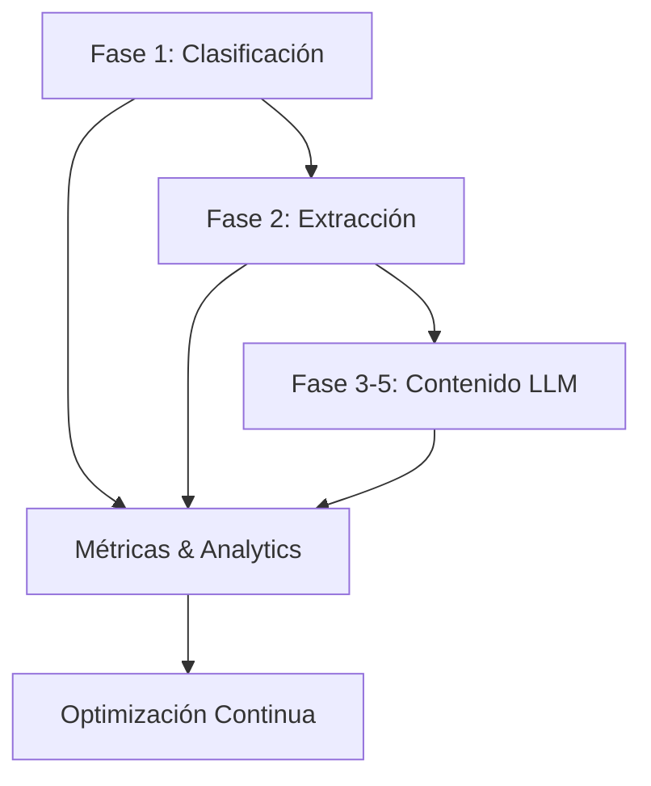

# Roadmap de Implementación, Métricas y Cambios de Base de Datos

**Documento maestro consolidado**

---

## PARTE 1: CAMBIOS COMPLETOS BASE DE DATOS

### 1.1 Nuevas Tablas

```sql
-- ============================================
-- FASE 1: CLASIFICACIÓN MULTI-CATEGORÍA
-- ============================================

CREATE TABLE documento_categorias (
  id UUID PRIMARY KEY DEFAULT gen_random_uuid(),
  documento_id UUID REFERENCES documentos_boe(id) ON DELETE CASCADE,
  categoria_id UUID REFERENCES categorias(id) ON DELETE CASCADE,
  confidence DECIMAL(3,2) NOT NULL CHECK (confidence BETWEEN 0 AND 1),
  clasificacion_metodo VARCHAR(20) NOT NULL CHECK (clasificacion_metodo IN ('rule', 'keyword', 'llm')),
  razonamiento TEXT,
  created_at TIMESTAMP DEFAULT NOW(),

  UNIQUE(documento_id, categoria_id)
);

CREATE INDEX idx_doc_cat_documento ON documento_categorias(documento_id);
CREATE INDEX idx_doc_cat_categoria ON documento_categorias(categoria_id);
CREATE INDEX idx_doc_cat_confidence ON documento_categorias(confidence DESC);
CREATE INDEX idx_doc_cat_metodo ON documento_categorias(clasificacion_metodo);

-- Feedback de clasificación
CREATE TABLE classification_feedback (
  id UUID PRIMARY KEY DEFAULT gen_random_uuid(),
  documento_id UUID REFERENCES documentos_boe(id),
  clasificacion_id UUID REFERENCES documento_categorias(id),
  correcto BOOLEAN NOT NULL,
  categoria_correcta UUID REFERENCES categorias(id),
  comentario TEXT,
  revisor_id UUID,
  created_at TIMESTAMP DEFAULT NOW()
);

CREATE INDEX idx_feedback_documento ON classification_feedback(documento_id);
CREATE INDEX idx_feedback_correcto ON classification_feedback(correcto);

-- Métricas de clasificación
CREATE TABLE classification_metrics (
  id UUID PRIMARY KEY DEFAULT gen_random_uuid(),
  categoria_id UUID REFERENCES categorias(id),
  periodo VARCHAR(10) NOT NULL, -- 'YYYY-WW'

  true_positives INT DEFAULT 0,
  false_positives INT DEFAULT 0,
  false_negatives INT DEFAULT 0,
  true_negatives INT DEFAULT 0,

  metric_precision DECIMAL(5,4),
  metric_recall DECIMAL(5,4),
  metric_f1_score DECIMAL(5,4),

  metodo_rule_count INT DEFAULT 0,
  metodo_keyword_count INT DEFAULT 0,
  metodo_llm_count INT DEFAULT 0,

  created_at TIMESTAMP DEFAULT NOW(),

  UNIQUE(categoria_id, periodo)
);

-- ============================================
-- FASE 2: EXTRACCIÓN DE DATOS ESTRUCTURADA
-- ============================================

-- Chunks semánticos del documento
CREATE TABLE document_chunks (
  id UUID PRIMARY KEY DEFAULT gen_random_uuid(),
  documento_id UUID REFERENCES documentos_boe(id) ON DELETE CASCADE,
  tipo VARCHAR(20) NOT NULL CHECK (tipo IN ('preambulo', 'articulo', 'disposicion', 'anexo')),
  numero INTEGER,
  titulo TEXT,
  contenido TEXT NOT NULL,
  embeddings VECTOR(1536), -- Para búsqueda semántica futura (pgvector extension)
  created_at TIMESTAMP DEFAULT NOW()
);

CREATE INDEX idx_chunk_documento ON document_chunks(documento_id);
CREATE INDEX idx_chunk_tipo ON document_chunks(tipo);
-- CREATE INDEX idx_chunk_embeddings ON document_chunks USING ivfflat (embeddings vector_cosine_ops); -- Requiere pgvector

-- Entidades extraídas
CREATE TABLE extracted_entities (
  id UUID PRIMARY KEY DEFAULT gen_random_uuid(),
  documento_id UUID REFERENCES documentos_boe(id) ON DELETE CASCADE,
  chunk_id UUID REFERENCES document_chunks(id) ON DELETE CASCADE,
  tipo VARCHAR(20) NOT NULL CHECK (tipo IN ('FECHA', 'CANTIDAD', 'ORGANISMO', 'LEY', 'PERSONA', 'LUGAR')),
  valor TEXT NOT NULL,
  contexto TEXT,
  confidence DECIMAL(3,2) CHECK (confidence BETWEEN 0 AND 1),
  created_at TIMESTAMP DEFAULT NOW()
);

CREATE INDEX idx_entity_doc ON extracted_entities(documento_id);
CREATE INDEX idx_entity_tipo ON extracted_entities(tipo);
CREATE INDEX idx_entity_valor ON extracted_entities USING gin(to_tsvector('spanish', valor));

-- Relaciones entre entidades
CREATE TABLE entity_relations (
  id UUID PRIMARY KEY DEFAULT gen_random_uuid(),
  documento_id UUID REFERENCES documentos_boe(id) ON DELETE CASCADE,
  entidad_origen_id UUID REFERENCES extracted_entities(id) ON DELETE CASCADE,
  entidad_destino_id UUID REFERENCES extracted_entities(id) ON DELETE CASCADE,
  tipo_relacion VARCHAR(30) NOT NULL CHECK (tipo_relacion IN ('MODIFICA', 'DEROGA', 'AFECTA_A', 'EMITIDO_POR', 'DIRIGIDO_A', 'PLAZO_PARA')),
  confidence DECIMAL(3,2) CHECK (confidence BETWEEN 0 AND 1),
  evidencia TEXT,
  created_at TIMESTAMP DEFAULT NOW()
);

CREATE INDEX idx_relation_doc ON entity_relations(documento_id);
CREATE INDEX idx_relation_tipo ON entity_relations(tipo_relacion);
CREATE INDEX idx_relation_origen ON entity_relations(entidad_origen_id);
CREATE INDEX idx_relation_destino ON entity_relations(entidad_destino_id);

-- Keywords rankeados
CREATE TABLE ranked_keywords (
  id UUID PRIMARY KEY DEFAULT gen_random_uuid(),
  documento_id UUID REFERENCES documentos_boe(id) ON DELETE CASCADE,
  term VARCHAR(100) NOT NULL,
  tfidf_score DECIMAL(10,6),
  category_relevance DECIMAL(3,2),
  final_score DECIMAL(10,6),
  appearances INTEGER,
  contexts JSONB, -- Array of context strings
  created_at TIMESTAMP DEFAULT NOW()
);

CREATE INDEX idx_keyword_doc ON ranked_keywords(documento_id);
CREATE INDEX idx_keyword_term ON ranked_keywords(term);
CREATE INDEX idx_keyword_score ON ranked_keywords(final_score DESC);

-- ============================================
-- FASE 3-5: CONTENIDO LLM CON NEUROMARKETING
-- ============================================

-- Hooks emocionales
CREATE TABLE emotional_hooks (
  id UUID PRIMARY KEY DEFAULT gen_random_uuid(),
  documento_id UUID REFERENCES documentos_boe(id) ON DELETE CASCADE,
  hook TEXT NOT NULL CHECK (char_length(hook) <= 100),
  trigger_usado VARCHAR(20) NOT NULL CHECK (trigger_usado IN ('URGENCIA', 'BENEFICIO', 'SORPRESA', 'RIESGO')),
  audience_target VARCHAR(100),
  modelo_usado VARCHAR(50),
  tokens_usados INTEGER,
  created_at TIMESTAMP DEFAULT NOW()
);

CREATE INDEX idx_hook_doc ON emotional_hooks(documento_id);
CREATE INDEX idx_hook_trigger ON emotional_hooks(trigger_usado);

-- Resúmenes ejecutivos mejorados
CREATE TABLE resumenes_ejecutivos (
  id UUID PRIMARY KEY DEFAULT gen_random_uuid(),
  documento_id UUID REFERENCES documentos_boe(id) ON DELETE CASCADE,
  elementos JSONB NOT NULL, -- Array de {tipo, texto, numero_destacado}
  flesch_reading_ease DECIMAL(5,2),
  grade_level DECIMAL(3,1),
  modelo_usado VARCHAR(50),
  tokens_usados INTEGER,
  created_at TIMESTAMP DEFAULT NOW()
);

CREATE INDEX idx_resumen_doc ON resumenes_ejecutivos(documento_id);
CREATE INDEX idx_resumen_readability ON resumenes_ejecutivos(flesch_reading_ease DESC);

-- Explicaciones educativas (reemplaza parcialmente explicaciones_llm)
CREATE TABLE explicaciones_educativas (
  id UUID PRIMARY KEY DEFAULT gen_random_uuid(),
  documento_id UUID REFERENCES documentos_boe(id) ON DELETE CASCADE,
  bloques JSONB NOT NULL, -- Array de {titulo, contenido, conceptos_clave, ejemplo_concreto}
  user_personas_target TEXT[], -- Array de tipos de usuario
  flesch_reading_ease DECIMAL(5,2),
  grade_level DECIMAL(3,1),
  avg_sentence_length DECIMAL(4,1),
  active_voice_ratio DECIMAL(3,2),
  modelo_usado VARCHAR(50),
  tokens_usados INTEGER,
  created_at TIMESTAMP DEFAULT NOW()
);

CREATE INDEX idx_explicacion_doc ON explicaciones_educativas(documento_id);
CREATE INDEX idx_explicacion_personas ON explicaciones_educativas USING gin(user_personas_target);
CREATE INDEX idx_explicacion_readability ON explicaciones_educativas(flesch_reading_ease DESC, grade_level ASC);

-- Accionables + CTA
CREATE TABLE accionables_cta (
  id UUID PRIMARY KEY DEFAULT gen_random_uuid(),
  documento_id UUID REFERENCES documentos_boe(id) ON DELETE CASCADE,
  tipo_documento VARCHAR(30) NOT NULL CHECK (tipo_documento IN ('tramite', 'informativo')),

  -- Para trámites
  requisitos JSONB, -- Array de {titulo, descripcion, tipo, items, critico, donde_obtener}
  pasos JSONB, -- Array de {numero, accion, descripcion, tiempo_estimado, enlaces, consejo}
  cta JSONB, -- {texto, urgencia, razon_urgencia, url_principal}

  -- Para informativos
  cambios_clave JSONB, -- Array de {que_cambia, valor_anterior, valor_nuevo, desde_cuando, requiere_accion}
  accion_requerida JSONB, -- {necesario, que_hacer, plazo}
  donde_mas_info JSONB, -- Array de {fuente, url}

  modelo_usado VARCHAR(50),
  tokens_usados INTEGER,
  created_at TIMESTAMP DEFAULT NOW()
);

CREATE INDEX idx_accionable_doc ON accionables_cta(documento_id);
CREATE INDEX idx_accionable_tipo ON accionables_cta(tipo_documento);

-- ============================================
-- MÉTRICAS DE CALIDAD
-- ============================================

CREATE TABLE quality_metrics (
  id UUID PRIMARY KEY DEFAULT gen_random_uuid(),
  documento_id UUID REFERENCES documentos_boe(id),
  fase VARCHAR(20) NOT NULL CHECK (fase IN ('hook', 'resumen', 'explicaciones', 'accionables')),

  -- Readability
  flesch_reading_ease DECIMAL(5,2),
  flesch_kincaid_grade DECIMAL(3,1),
  avg_sentence_length DECIMAL(4,1),

  -- Content
  active_voice_ratio DECIMAL(3,2),
  concrete_numbers_count INTEGER,
  jargon_terms_count INTEGER,
  example_quality_score DECIMAL(3,2),

  -- Emotional
  trigger_detected BOOLEAN,
  trigger_type VARCHAR(20),
  emotional_words_count INTEGER,

  -- Compliance
  schema_valid BOOLEAN,
  required_fields_complete BOOLEAN,
  character_limits_ok BOOLEAN,

  -- Overall
  quality_score INTEGER CHECK (quality_score BETWEEN 0 AND 100),
  passed_validation BOOLEAN,
  issues TEXT[],

  created_at TIMESTAMP DEFAULT NOW()
);

CREATE INDEX idx_quality_doc ON quality_metrics(documento_id);
CREATE INDEX idx_quality_fase ON quality_metrics(fase);
CREATE INDEX idx_quality_score ON quality_metrics(quality_score DESC);
CREATE INDEX idx_quality_passed ON quality_metrics(passed_validation);

-- Human evaluation
CREATE TABLE human_evaluation (
  id UUID PRIMARY KEY DEFAULT gen_random_uuid(),
  documento_id UUID REFERENCES documentos_boe(id),
  fase VARCHAR(20) NOT NULL,
  evaluador_id UUID,

  claridad INTEGER CHECK (claridad BETWEEN 1 AND 5),
  precision INTEGER CHECK (precision BETWEEN 1 AND 5),
  relevancia INTEGER CHECK (relevancia BETWEEN 1 AND 5),
  accionabilidad INTEGER CHECK (accionabilidad BETWEEN 1 AND 5),
  tono INTEGER CHECK (tono BETWEEN 1 AND 5),
  confianza INTEGER CHECK (confianza BETWEEN 1 AND 5),

  score_total DECIMAL(3,2) GENERATED ALWAYS AS (
    (claridad + precision + relevancia + accionabilidad + tono + confianza)::DECIMAL / 6
  ) STORED,
  aprobado BOOLEAN GENERATED ALWAYS AS (score_total >= 3.5) STORED,

  comentarios TEXT,
  created_at TIMESTAMP DEFAULT NOW()
);

CREATE INDEX idx_eval_doc ON human_evaluation(documento_id);
CREATE INDEX idx_eval_fase ON human_evaluation(fase);
CREATE INDEX idx_eval_score ON human_evaluation(score_total DESC);
CREATE INDEX idx_eval_aprobado ON human_evaluation(aprobado);

-- Analytics de engagement
CREATE TABLE document_analytics (
  id UUID PRIMARY KEY DEFAULT gen_random_uuid(),
  documento_id UUID REFERENCES documentos_boe(id),

  views INTEGER DEFAULT 0,
  hook_clicks INTEGER DEFAULT 0, -- Click en hook para ver más
  detail_opens INTEGER DEFAULT 0, -- Abre modal/detalle
  pdf_downloads INTEGER DEFAULT 0,
  shares INTEGER DEFAULT 0,

  avg_time_on_page INTEGER, -- Segundos
  avg_scroll_depth DECIMAL(3,2), -- 0-1
  bounce_rate DECIMAL(3,2), -- 0-1

  cta_clicks INTEGER DEFAULT 0,
  cta_conversion_rate DECIMAL(3,2),

  periodo DATE NOT NULL, -- Agregación diaria
  created_at TIMESTAMP DEFAULT NOW(),

  UNIQUE(documento_id, periodo)
);

CREATE INDEX idx_analytics_doc ON document_analytics(documento_id);
CREATE INDEX idx_analytics_periodo ON document_analytics(periodo DESC);
CREATE INDEX idx_analytics_views ON document_analytics(views DESC);
CREATE INDEX idx_analytics_engagement ON document_analytics(detail_opens DESC, avg_time_on_page DESC);
```

### 1.2 Migraciones de Datos Existentes

```sql
-- Migrar categoría única a multi-categoría
INSERT INTO documento_categorias (documento_id, categoria_id, confidence, clasificacion_metodo)
SELECT id, categoria_id, 1.0, 'legacy'
FROM documentos_boe
WHERE categoria_id IS NOT NULL;

-- Migrar explicaciones_llm existentes a nuevo formato
-- (Requiere script de transformación - no trivial porque cambia estructura)

-- Crear vista para compatibilidad backwards
CREATE VIEW documentos_con_categoria_principal AS
SELECT
  d.*,
  dc.categoria_id,
  dc.confidence
FROM documentos_boe d
LEFT JOIN LATERAL (
  SELECT categoria_id, confidence
  FROM documento_categorias
  WHERE documento_id = d.id
  ORDER BY confidence DESC
  LIMIT 1
) dc ON TRUE;
```

### 1.3 Extensiones PostgreSQL Necesarias

```sql
-- Para embeddings semánticos (futuro)
CREATE EXTENSION IF NOT EXISTS vector;

-- Para búsqueda full-text mejorada
CREATE EXTENSION IF NOT EXISTS pg_trgm;

-- Para analytics
CREATE EXTENSION IF NOT EXISTS tablefunc;
```

---

## PARTE 2: MÉTRICAS Y KPIS CONSOLIDADOS

### 2.1 Dashboard de Métricas (3 Niveles)

#### NIVEL 1: MÉTRICAS DE SISTEMA (Operational)

```typescript
interface SystemMetrics {
  // Processing Performance
  documentos_procesados_semana: number
  tiempo_promedio_procesamiento_ms: number
  tasa_error_procesamiento: number // %

  // Classification
  precision_promedio: number // Across all categories
  recall_promedio: number
  f1_score_promedio: number
  documentos_multi_categoria: number // %

  // Cost
  costo_total_semanal: number // $
  costo_promedio_documento: number // $
  tokens_consumidos: number
  presupuesto_utilizado: number // %

  // Quality
  documentos_validacion_pasada: number // %
  promedio_quality_score: number // 0-100
  promedio_human_evaluation: number // 1-5
}
```

**Dashboards:**
- Grafana + PostgreSQL
- Alertas: Error rate > 5%, Cost > budget, Quality < 70

---

#### NIVEL 2: MÉTRICAS DE CONTENIDO (Quality)

```typescript
interface ContentQualityMetrics {
  // Readability
  flesch_avg: number // Target: 65
  grade_level_avg: number // Target: 7.5
  active_voice_avg: number // Target: 80%

  // Por Fase
  hook: {
    promedio_longitud: number
    distribucion_triggers: Record<TriggerType, number> // %
    ctr_promedio: number // %
  }

  resumen: {
    elementos_promedio: number // Should be 2-3
    readability_compliance: number // %
    numeros_concretos_promedio: number
  }

  explicaciones: {
    bloques_promedio: number // Should be 4±1
    ejemplos_concretos: number // %
    jargon_no_explicado: number // Should be 0
  }

  accionables: {
    requisitos_promedio: number
    pasos_promedio: number
    tiempo_estimado_presente: number // %
    cta_urgencia_distribucion: Record<string, number>
  }

  // Human Evaluation Breakdown
  human_scores: {
    claridad: number
    precision: number
    relevancia: number
    accionabilidad: number
    tono: number
    confianza: number
  }
}
```

**Weekly Report Automático:**
```sql
-- Query para weekly content quality report
SELECT
  COUNT(*) as total_docs,
  AVG(qm.flesch_reading_ease) as avg_readability,
  AVG(qm.quality_score) as avg_quality,
  COUNT(*) FILTER (WHERE qm.passed_validation) * 100.0 / COUNT(*) as pass_rate,
  AVG(he.score_total) as avg_human_score
FROM documentos_boe d
LEFT JOIN quality_metrics qm ON d.id = qm.documento_id
LEFT JOIN human_evaluation he ON d.id = he.documento_id
WHERE d.created_at >= NOW() - INTERVAL '7 days';
```

---

#### NIVEL 3: MÉTRICAS DE USUARIO (Impact)

```typescript
interface UserEngagementMetrics {
  // Discovery
  visitas_totales: number
  usuarios_unicos: number
  bounce_rate: number // Target: < 40%

  // Engagement (Progressive Disclosure)
  hook_ctr: number // % que hacen click en hook
  detalle_open_rate: number // % que abren detalle completo
  tiempo_promedio_pagina: number // segundos, Target: 90+
  scroll_depth_promedio: number // %, Target: 75+

  // Actions
  pdf_download_rate: number // %
  share_rate: number // %
  cta_conversion_rate: number // %, Target: 15+

  // Por Categoría
  categoria_mas_vista: string
  categoria_mayor_engagement: string
  categoria_mayor_conversion: string

  // Por Trigger Emocional
  trigger_performance: Record<TriggerType, {
    avg_ctr: number
    avg_time_on_page: number
    conversion_rate: number
  }>

  // Feedback
  rating_promedio: number // Si implementamos rating
  feedback_positivo: number // %
}
```

**Analytics Integration:**
```typescript
// Google Analytics 4 Custom Events
gtag('event', 'hook_click', {
  documento_id: doc.id,
  categoria: doc.categoria,
  trigger_tipo: doc.hook.trigger_usado
})

gtag('event', 'detalle_open', {
  documento_id: doc.id,
  tiempo_desde_vista: seconds
})

gtag('event', 'cta_click', {
  documento_id: doc.id,
  cta_urgencia: doc.cta.urgencia,
  dias_restantes: doc.fecha_limite_dias
})
```

---

### 2.2 Targets Consolidados

| Categoría | Métrica | Baseline | Target Q1 | Target Q2 | Medición |
|-----------|---------|----------|-----------|-----------|----------|
| **SISTEMA** |
| | Tasa error | 3% | <2% | <1% | Automático |
| | Costo/doc | $0.008 | $0.004 | $0.002 | Automático |
| | Tiempo proceso | 8s | 5s | 3s | Automático |
| **CLASIFICACIÓN** |
| | F1 Score promedio | 0.75 | 0.85 | 0.90 | Semanal |
| | Precision (Opos/Ayudas) | 0.80 | 0.88 | 0.92 | Semanal |
| | Recall (Opos/Ayudas) | 0.82 | 0.90 | 0.95 | Semanal |
| **CALIDAD CONTENIDO** |
| | Flesch Reading Ease | 45 | 60 | 65 | Automático |
| | Grade Level | 11 | 8.5 | 7.5 | Automático |
| | Quality Score | 65 | 75 | 85 | Automático |
| | Human Evaluation | 3.2 | 4.0 | 4.3 | Semanal |
| **ENGAGEMENT** |
| | Hook CTR | 25% | 35% | 45% | GA4 |
| | Tiempo en página | 45s | 70s | 90s | GA4 |
| | Scroll depth | 50% | 65% | 75% | GA4 |
| | Bounce rate | 55% | 45% | <40% | GA4 |
| | CTA conversion | 8% | 12% | 15% | GA4 |

---

## PARTE 3: ROADMAP DE IMPLEMENTACIÓN COMPLETO

### 3.1 Fases Priorizadas (20 semanas = 5 meses)

```
FASE 1: CLASIFICACIÓN
├─ Sprint 1-2 (Weeks 1-2): Multi-category DB + Migration
├─ Sprint 3-4 (Weeks 3-4): Enhanced Keyword Scoring
├─ Sprint 5-6 (Weeks 5-6): Rule-based Classification
├─ Sprint 7-8 (Weeks 7-8): LLM Fallback + Metrics
└─ Sprint 9-10 (Weeks 9-10): Continuous Learning Setup

FASE 2: EXTRACCIÓN
├─ Sprint 11-12 (Weeks 11-12): Semantic Chunking + NER
├─ Sprint 13-14 (Weeks 13-14): Category-specific Extraction
├─ Sprint 15-16 (Weeks 15-16): Smart Dates + Keywords
└─ Sprint 17-18 (Weeks 17-18): Entity Relations

FASE 3-5: CONTENIDO LLM
├─ Sprint 19-20 (Weeks 19-20): Hook Emocional
├─ Sprint 21-22 (Weeks 21-22): Resumen Ejecutivo
├─ Sprint 23-24 (Weeks 23-24): Explicaciones Educativas
├─ Sprint 25-26 (Weeks 25-26): Accionables + CTA
└─ Sprint 27-28 (Weeks 27-28): Optimización + Human Eval

OPTIMIZACIÓN CONTINUA (Ongoing)
└─ A/B Testing, Prompt Tuning, Cost Optimization
```

---

### 3.2 Roadmap Detallado

#### **SEMANAS 1-2: Multi-Category Foundation**

**Objetivo**: Permitir múltiples categorías por documento

**Tareas:**
- [ ] Crear tabla `documento_categorias`
- [ ] Migrar datos existentes
- [ ] Actualizar `useSupabase.ts` queries
- [ ] Modificar UI cards para mostrar múltiples badges
- [ ] Testing con 100 documentos históricos

**Entregables:**
- Database migration script
- Updated API endpoints
- Multi-badge UI component

**Métricas Éxito:**
- 0 breaking changes en producción
- 100% documentos migrados correctamente
- UI renderiza múltiples categorías

---

#### **SEMANAS 3-4: Enhanced Keyword Scoring**

**Objetivo**: Mejorar clasificación con ponderación

**Tareas:**
- [ ] Definir keywords ponderados para 12 categorías
- [ ] Implementar scoring engine
- [ ] Añadir metadata scoring (sección, rango, departamento)
- [ ] Calcular confidence scores
- [ ] A/B test vs. sistema actual

**Entregables:**
- `enhanced-classifier.ts`
- Weighted keywords JSON
- Confidence score algorithm

**Métricas Éxito:**
- Precision +10% vs. baseline
- Recall +8% vs. baseline
- Confidence score correlaciona con accuracy (>0.7)

---

#### **SEMANAS 5-6: Rule-Based Classification**

**Objetivo**: 60-70% documentos clasificados sin LLM

**Tareas:**
- [ ] Definir rules para top 6 categorías
- [ ] Implementar rule engine
- [ ] Prioridad: rule > keyword > LLM
- [ ] Testing con 2000 documentos
- [ ] Documentar rules descubiertas

**Entregables:**
- Rule engine
- Rule definitions JSON
- Test results report

**Métricas Éxito:**
- 60%+ documentos por rules (alta confianza)
- Precision rules > 90%
- Tiempo clasificación < 5ms para rules

---

#### **SEMANAS 7-8: LLM Fallback + Tracking**

**Objetivo**: Clasificar restantes + medir todo

**Tareas:**
- [ ] Implementar LLM classification con JSON schema
- [ ] Crear tabla `classification_feedback`
- [ ] Crear tabla `classification_metrics`
- [ ] Weekly report automation
- [ ] Admin UI para validation

**Entregables:**
- LLM classifier con structured output
- Feedback loop UI
- Metrics dashboard (Grafana)

**Métricas Éxito:**
- 100% documentos clasificados
- Human validation UI funcional
- Weekly report automático generado

---

#### **SEMANAS 9-10: Continuous Learning**

**Objetivo**: Sistema que mejora con el tiempo

**Tareas:**
- [ ] Keyword discovery algorithm
- [ ] Rule extraction from LLM patterns
- [ ] Monthly review process
- [ ] Documentation de patrones encontrados

**Entregables:**
- Auto-discovery scripts
- Pattern extraction tool
- Monthly review checklist

**Métricas Éxito:**
- 5+ nuevos keywords descubiertos/mes
- 2+ nuevas rules extraídas/mes
- F1 score mejora +3% trimestre

---

#### **SEMANAS 11-12: Semantic Chunking + NER**

**Objetivo**: Extracción estructurada sin LLM

**Tareas:**
- [ ] Implementar XML parser a chunks
- [ ] Integrar compromise.js para NER
- [ ] Crear tablas `document_chunks`, `extracted_entities`
- [ ] Testing con 500 documentos diversos

**Entregables:**
- Chunking engine
- NER pipeline
- Entity storage

**Métricas Éxito:**
- 95%+ fechas detectadas
- 90%+ organismos detectados
- 85%+ leyes detectadas

---

#### **SEMANAS 13-14: Category-Specific Extraction**

**Objetivo**: Datos estructurados validados

**Tareas:**
- [ ] Definir JSON schemas para 5 categorías principales
- [ ] Implementar extraction logic por categoría
- [ ] Integrar Ajv validation
- [ ] Error logging y mejora iterativa

**Entregables:**
- 5 extraction schemas
- Validation pipeline
- Error analysis report

**Métricas Éxito:**
- 80%+ schema compliance
- 75%+ completeness (campos requeridos)
- Validation errors logged y analizados

---

#### **SEMANAS 15-16: Smart Dates + Ranked Keywords**

**Objetivo**: Fechas con contexto y keywords priorizados

**Tareas:**
- [ ] Context-aware date classification
- [ ] Urgencia detection
- [ ] TF-IDF keyword ranking
- [ ] Category relevance boosting

**Entregables:**
- Smart date classifier
- TF-IDF ranker
- Top 20 keywords/doc

**Métricas Éxito:**
- 85%+ fechas clasificadas correctamente (tipo)
- Keywords relevantes en top 5
- Correlation con etiquetas manuales > 0.7

---

#### **SEMANAS 17-18: Entity Relations**

**Objetivo**: Grafo de relaciones entre entidades

**Tareas:**
- [ ] Implementar relation extraction
- [ ] Crear tabla `entity_relations`
- [ ] Graph queries optimization
- [ ] UI para visualizar relaciones

**Entregables:**
- Relation extractor
- Graph storage
- Relation visualization (futuro feature)

**Métricas Éxito:**
- 60%+ relations correctas (human validation)
- Query performance < 100ms
- Fundamento para features futuras (ej: "Leyes relacionadas")

---

#### **SEMANAS 19-20: Hook Emocional**

**Objetivo**: Primera línea que captura atención

**Tareas:**
- [ ] Implementar hook generation con JSON schema
- [ ] 4 tipos de triggers emocionales
- [ ] UI con color psychology
- [ ] A/B testing hooks

**Entregables:**
- Hook generator
- Trigger-based styling
- A/B test framework

**Métricas Éxito:**
- CTR hook > 35% (vs 25% baseline)
- User testing: 8/10 "me llama la atención"
- Costo < $0.0003/doc

---

#### **SEMANAS 21-22: Resumen Ejecutivo Mejorado**

**Objetivo**: 2-3 elementos ultra-claros

**Tareas:**
- [ ] Nuevo prompt con plain language
- [ ] Readability validation automática
- [ ] Category-adaptive structure
- [ ] A/B test vs. resumen actual

**Entregables:**
- Nuevo resumen generator
- Readability validator
- Comparative study

**Métricas Éxito:**
- Flesch score > 60
- Grade level < 8.5
- User testing: "Lo entendí" > 85%

---

#### **SEMANAS 23-24: Explicaciones Educativas**

**Objetivo**: 4 bloques con ejemplos concretos

**Tareas:**
- [ ] Implementar 4-block structure
- [ ] User persona adaptation
- [ ] Ejemplo concreto enforcement
- [ ] Human evaluation setup (50 docs/week)

**Entregables:**
- Explicaciones generator
- Persona detection
- Human eval UI

**Métricas Éxito:**
- Human evaluation > 4.0/5
- 80%+ tienen ejemplos concretos
- Jargon no explicado = 0

---

#### **SEMANAS 25-26: Accionables + CTA**

**Objetivo**: Checklist + timeline + urgencia

**Tareas:**
- [ ] Requisitos con checklist interactivo
- [ ] Pasos con tiempo estimado
- [ ] CTA según urgencia
- [ ] Conversion tracking

**Entregables:**
- Accionables generator
- Interactive checklist UI
- CTA component

**Métricas Éxito:**
- CTA conversion > 12% (vs 8%)
- Time on page > 70s
- User testing: "Sé qué hacer" > 80%

---

#### **SEMANAS 27-28: Optimización + Evaluación**

**Objetivo**: Refinamiento basado en datos

**Tareas:**
- [ ] Analizar métricas completas
- [ ] Prompt tuning para costos
- [ ] Human evaluation análisis
- [ ] Documentación best practices

**Entregables:**
- Optimization report
- Updated prompts
- Best practices guide

**Métricas Éxito:**
- Costo reducido 20%+ vs. semana 19
- Quality score > 80
- Readiness para producción completa

---

### 3.3 Dependencias Críticas



**No se puede empezar:**
- Fase 2 hasta tener multi-category (Fase 1.1 completa)
- Fase 3-5 hasta tener extracción estructurada (Fase 2.1-2.2)
- Optimización hasta tener métricas completas

---

### 3.4 Recursos Necesarios

#### Desarrollo
- **1 Backend Dev** (full-time): Fases 1-2, schemas DB
- **1 Full-Stack Dev** (full-time): Fases 3-5, UI components
- **1 Data Scientist/ML** (part-time 50%): Classification, NER, optimization
- **1 Content Designer** (part-time 30%): Prompts, validation, guidelines

#### Infraestructura
- **Supabase Pro**: $25/mes (más storage)
- **OpenAI API**: ~$100-200/mes (procesamiento)
- **Grafana Cloud**: $0 (tier free) o $49/mes (pro)
- **Testing environment**: Clone de producción

#### Herramientas
- **Ajv** (JSON Schema): Free
- **compromise.js** (NER): Free
- **natural** (TF-IDF): Free
- **text-readability** (metrics): Free

**Costo Total Estimado**: ~$300-400/mes durante implementación

---

### 3.5 Riesgos y Mitigaciones

| Riesgo | Probabilidad | Impacto | Mitigación |
|--------|--------------|---------|------------|
| Migration breaks prod | Media | Alto | Staging environment + rollback plan |
| LLM costs exceed budget | Media | Medio | Cost controls + alerts + phase rollout |
| Quality metrics no mejoran | Baja | Alto | A/B testing + user feedback early |
| Team capacity insuficiente | Media | Medio | Priorizar fases críticas + external help |
| BOE API changes structure | Baja | Alto | Monitoring + fallback parsing |
| User resistance to changes | Media | Medio | Gradual rollout + feedback loop |

---

## PARTE 4: SIGUIENTES PASOS INMEDIATOS

### Acción 1: Decisión de Arranque
**¿Proceder con implementación?**
- [ ] Sí → Crear repo branch `feature/neuromarketing-redesign`
- [ ] Parcial → Priorizar solo Fases 1-2 (clasificación + extracción)
- [ ] No ahora → Archivar research, retomar más adelante

### Acción 2: Setup Inicial (Si procede)
- [ ] Crear environment de staging
- [ ] Setup database migrations workflow
- [ ] Configurar Grafana dashboards
- [ ] Definir team roles

### Acción 3: Sprint 0 (Semana 0)
- [ ] Kickoff meeting con equipo
- [ ] Review completo de documentación
- [ ] Setup tooling (linters, testing, CI/CD)
- [ ] Primera migración DB en staging

---

## DOCUMENTACIÓN GENERADA

Todos los documentos de investigación y diseño:

1. **`research-synthesis-neuromarketing-cognitive-science.md`**
   - Investigación completa con 40+ fuentes
   - Principios científicos aplicables
   - Base teórica para decisiones

2. **`phase-1-classification-redesign.md`**
   - Sistema híbrido 3 niveles
   - Multi-category support
   - Métricas y continuous learning

3. **`phase-2-data-extraction-optimization.md`**
   - Semantic chunking
   - NER sin LLM
   - Structured data con schemas

4. **`phases-3-4-5-llm-content-generation.md`**
   - 5 fases de contenido (hook + 4 actuales mejoradas)
   - Prompts optimizados con cognitive science
   - Validation automática

5. **`implementation-roadmap-metrics-db.md`** (este documento)
   - Database schema completo
   - Métricas 3 niveles
   - Roadmap 28 semanas detallado

---

**¿Listo para comenzar la implementación?**
